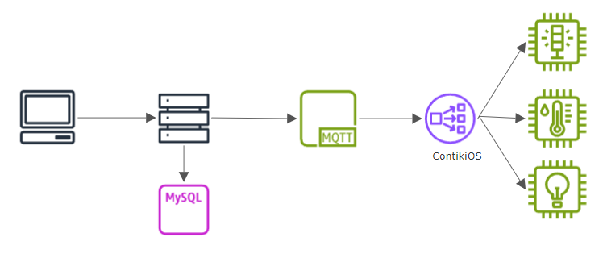
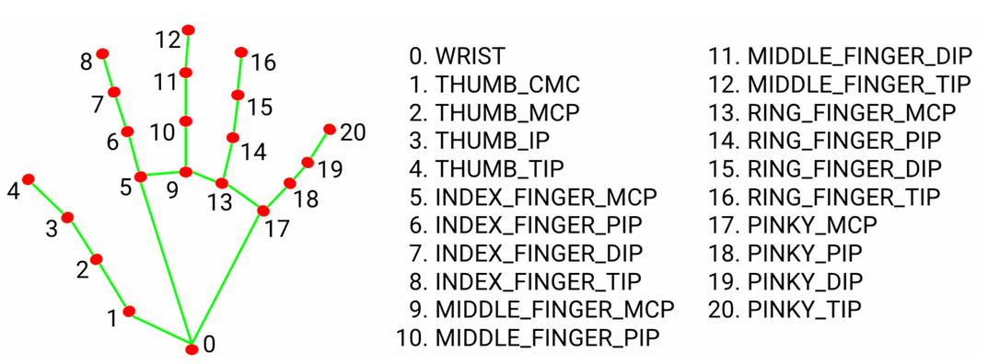
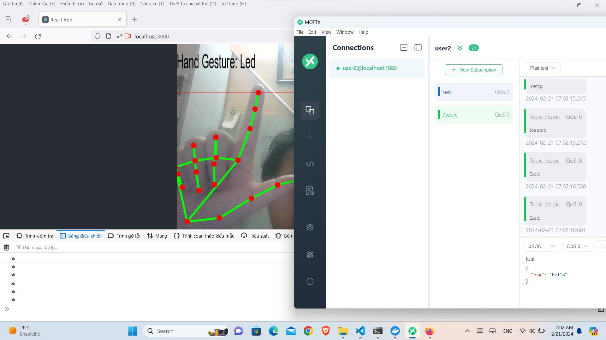

## WEB APP HAND GESTURE WITH MEDIAPIPE AND TFJS

<b>1.  Overview:</b>

This project is a small branch within another project "Hand gesture to control 6LOWPAN".

This is a general flowchart of the large project

This repository is about how Client use hand gesture to communicate with Server and connect to MQTT Server.

<b> 2. Hand Gesture</b>

The model is based on MediaPipe api which provides way to catch if the hands is exist on frame and extract the position of nodes which will be use to predict after CNN model.

The model I use to predict base on those nodes is based on this repository 
https://github.com/kinivi/hand-gesture-recognition-mediapipe

After training model, I used tensorflowjs to convert the model weight and parameter in .h5 file to .json file, and then loaded it to my React app as well the cdn of mediapipe to define nodes.

Otherwise, I used some api of React like useRef and WebcamRef to sendFrame when if something change on the frame, used canvas to draw the landmark and box of hand and basic html and react bootstrap to decorate the page.

<b>3. MQTT</b>

MQTT Server is host on Docker containers. I have created the docker compose.yml to run docker containers file and MQTT_client.py in this repository

<b>4. Demo </b>
