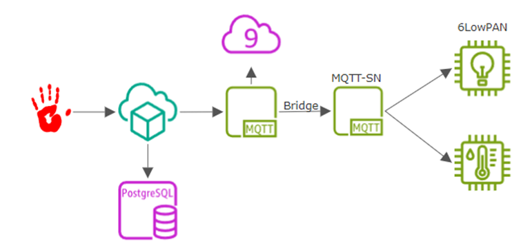
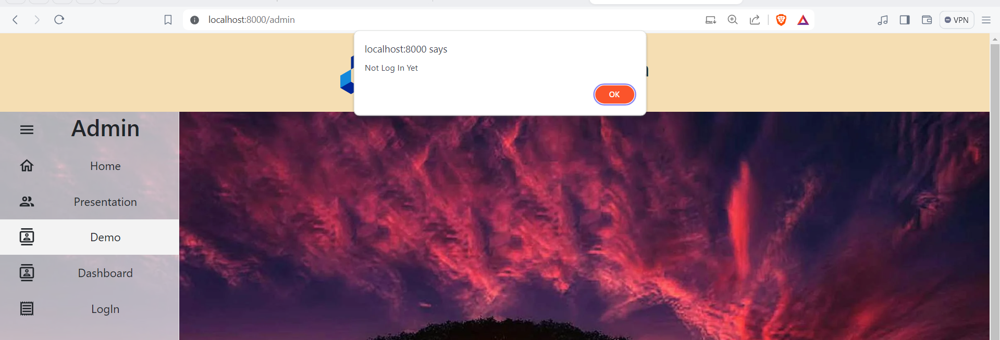
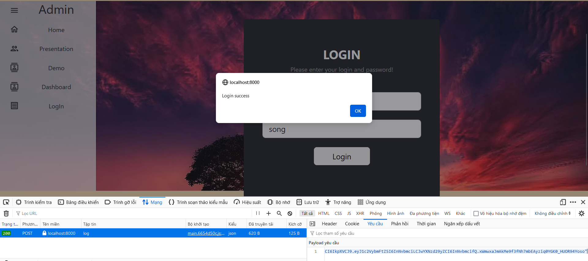
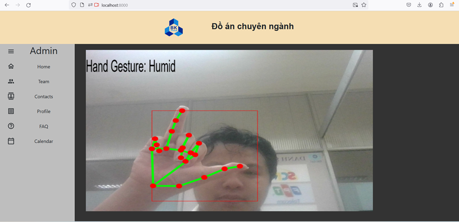
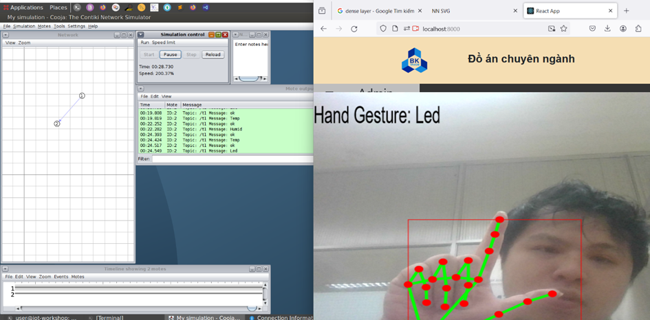

## WEB APP HAND GESTURE WITH MEDIAPIPE AND TFJS

<b>1.  Overview:</b>

This project is a small branch within another project "Hand gesture to control 6LOWPAN".

This is a general flowchart of the large project

This repository is about how Client use hand gesture to communicate with Server and connect to MQTT Server.

<b> 2. Hand Gesture</b>

The model is based on MediaPipe api which provides way to catch if the hands is exist on frame and extract the position of nodes which will be use to predict after CNN model.

The model I use to predict base on those nodes is based on this repository 
https://github.com/kinivi/hand-gesture-recognition-mediapipe

After training model, I used tensorflowjs to convert the model weight and parameter in .h5 file to .json file, and then loaded it to my React app as well the cdn of mediapipe to define nodes.

Otherwise, I used some api of React like useRef and WebcamRef to sendFrame when if something change on the frame, used canvas to draw the landmark and box of hand and basic html and react bootstrap to decorate the page.

Moreover, when I useRef and Camera-utils the camera will have a Callback onFrame when camera frame is ready, I can not just slow down the onFrame process because it will decrease the experiment of user. So that, I will have some algorithms to make sure that if the predict is same after 20 predict then it will post the request to backend and draw some canvas, or when there is a change or no hands on camera it will reset the count of 20.

<b>3. MQTT - MQTTSN</b>

MQTT Server is host on Docker containers. I have created the docker compose.yml to run docker containers file and MQTT_client.py in this repository

To communicate with 6LowPAN you must use MQTT-SN and RSMB

<b>4. ContikiOS </b>

I have writed bash script and Cooja simulate in this repository. 

<b>5. Authorization-Authentication</b>
In front end react, I will have some authorization request which I will send check user request to my backend if the client try to access Demo/Dashboard topic.

When the user is login which user/pass is song/song, the access token will send from server. The access token in real world may have some algorithms to make sure the client can't easily jwt encode it. Make sure the request is send in jwt type so that packet receive app like wideshark may not know what is real data 

After that, when access resource from server, server can track the access token, we may have something like time-access to handle the token in backend to make sure the token is not get from some other request.

<b>6. Demo </b>
Web APP Hand Gesture:

Web App Hand Gesture with Cooja:
