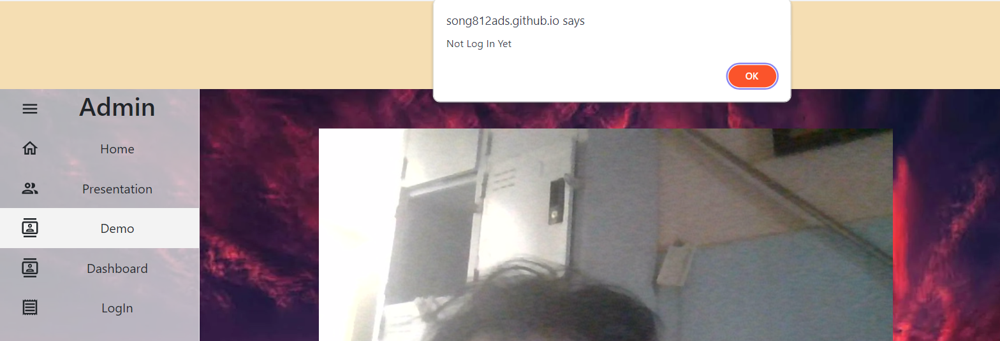
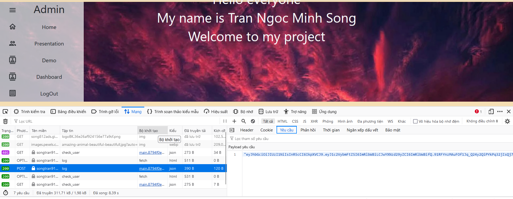
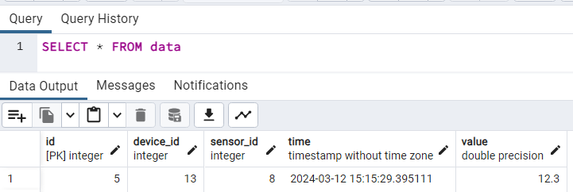
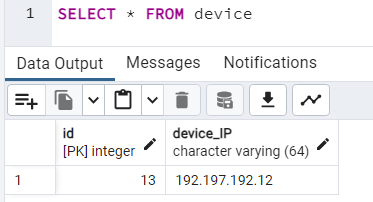
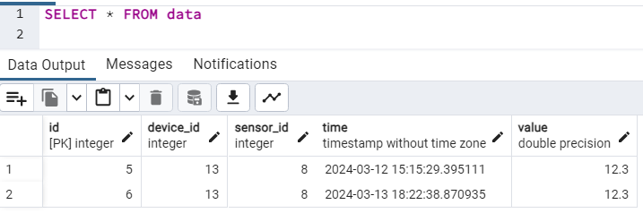
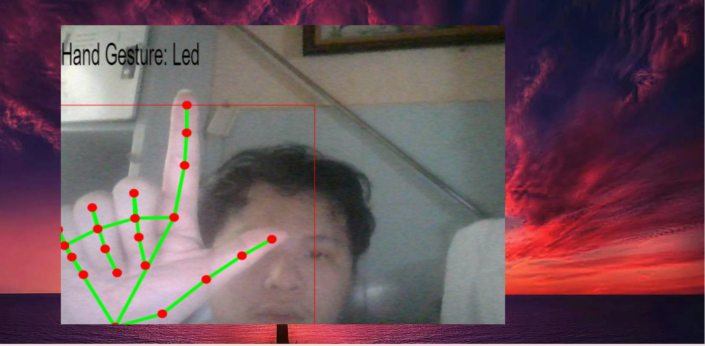
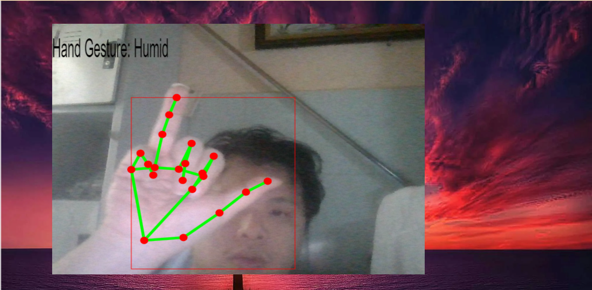
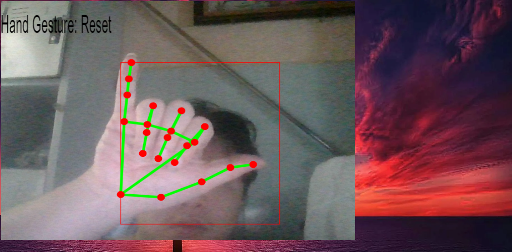

    ## WEB APP HAND GESTURE WITH MEDIAPIPE AND TFJS

<b>1.  Overview:</b>

This project is a small branch within another project "Hand gesture to control 6LOWPAN".

This is a general flowchart of the large project

This repository is about how Client use hand gesture to communicate with Server and connect to MQTT Server.

<b> 2. Hand Gesture</b>

The model is based on MediaPipe api which provides way to catch if the hands is exist on frame and extract the position of nodes which will be use to predict after CNN model.

The model I use to predict base on those nodes is based on this repository 
https://github.com/kinivi/hand-gesture-recognition-mediapipe

After training model, I used tensorflowjs to convert the model weight and parameter in .h5 file to .json file, and then loaded it to my React app as well the cdn of mediapipe to define nodes.

Otherwise, I used some api of React like useRef and WebcamRef to sendFrame when if something change on the frame, used canvas to draw the landmark and box of hand and basic html and react bootstrap to decorate the page.

<b>3. MQTT, MQTT-SN</b>

MQTT Server is host on Docker containers. I have created the docker compose.yml to run docker containers file and MQTT_client.py in this repository

When communicate with Ipv6 LowPAN, we cannot use MQTT brokers directly but we must use MQTT-SN with RSMB(Really Small Message Brokers)

I will host MQTT brokers on HiveMQ or local and host RSMB on localhost and use bridge.py to connect them.

<b>4. Authorization and Authentication </b>

When user is not login, I will check by send a request to server for make sure there is login or not yet.The check is to make sure user get to some topic that need login must be authenticated.

When user is login, the access token will send back to client from server, frontend will store it on session storage. Now with different user, they can have different permission. 

Other things is that to make sure the package cannot be read easily from outside I will JWT encode the request and decode in backend. In here, if neccessary, there will be some algorithms for user cannot easily JWT decode it 

<b>5. Database - Postgresql:</b>

This is for my hardware to receive, collect the temperature or humid in sensor. I will have 2 relation 1-to-many in Data table.

Because, it's not in this demo I will show some image about how it work

When there is no data yet in database 

When they have same device, same sensor but different data or time:

So that when update, data there will be no conflict on other table and when erase device or sensor there will be different type of change. If lazy the data table will not erase, if cascade the data in data table will be erase.

<b>6. Hosting app </b>

My frontend app is host on Github, which make my url get breakdown if it goes outside the mainpage. 

My backend is host on Pythoniseverywhere

<b>7. Demo </b>

Have fun with my project, I will train more and update the type of my train later. Make sure your camera is ready and user/pass in demo topic is demo/demo.

Type of my hand train:

